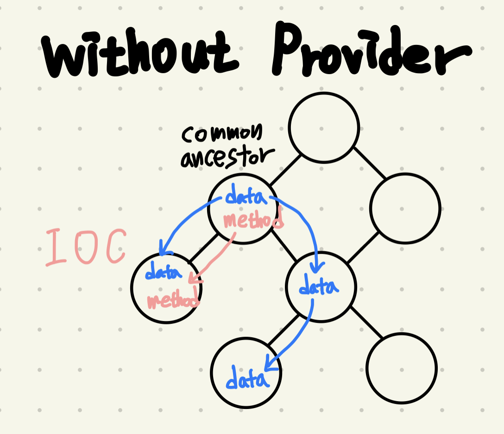

# provider_examples

### [1. naive_state_management](./lib/naive_state_management.dart)

- After defining the state and methods in the common ancestor parent, when passed down to the lower widget, the lower widget runs (Inversion Of Control).

### [2. access_data_with_provider](./lib/access_data_with_provider.dart)
- Since the provider itself is also a widget, children of the provider widget can access the object returned by the create() method.
- Provider.of<T>() is used to access the object.

### [3. listen_data_with_change_notifier](./lib/listen_data_with_change_notifier.dart)
- Classes that mixin the ChangeNotifier class provide addListener and notifyListeners methods to detect, notify changes.
- Note that you must remove the listener yourself using removeListener.
- Since changenotifier does not affect UI synchronization, you need to call the setState function in the listening method to synchronize the UI.

### [4.access_and_listen_data_with_change_notifier_provider](./lib/access_and_listen_data_with_change_notifier_provider.dart)
- ChangeNotifierProvider is a combination of ChangeNotifier and Provider. It allows for dependency injection and UI synchronization.
- When the ChangeNotifier is no longer needed, it is automatically removed from memory-
- When accessing the type of T through provider.of, there are two ways:
  - Provider.of<T>(context): You can listen for changes. If there is a change, it will rebuild.
  - Provider.of<T>(context, listen: false): You only access the instance and do not listen for changes. This is mostly used for methods and properties that don't change.

### [5. provider_extension_method](./lib/provider_extension_method.dart)
- context.watch<T>() - is equivalent to Provider.of<T>(context)
- context.read<T>() - is equivalent to Provider.of<T>(context, listen: false)
- context.select<T>() - partially listens to changes

### [6. future_provider_example](./lib/future_provider_example.dart)
- The `FutureProvider` widget is used when the provider needs time to fetch data, so it requires an initial value for the required parameter.
- Widgets that reference FutureProvider are built twice: once for the initial value and once for the return value.
- in most cases, the `FutureBuilder` widget is used instead.
- If a widget needs multiple providers, it requires multiple levels of parents. However, `MultiProvider` makes it easy to read and is essentially syntax sugar.
- In this case, the FureProvider can access the DogChangeNotifierProvider because they are parent and child. Although they may appear to be siblings due to the syntax sugar provided by MultiProvider.
- The type of provider corresponds to the return type of the future method.

### [7. stream_provider_example](./lib/stream_provider_example.dart)
- Continuous values are supplied through StreamProvider.
- It is used more than FutureProvider for things like Firebase, battery, stock, etc.
- If you use the watch method within the create function, it will throw an error. Read is more appropriate as create is only called once in the lifecycle.

### [8. consumer_example.dart](./lib/consumer_example.dart)
- Consumer widget finds the corresponding provider type and passes it as a parameter to the builder method.
- Consumer widget doesn't perform any complicated tasks. It simply calls Provider.of in a new widget and delegates the build implementation to the builder.
- Widgets set in the 'child' parameter are not rebuilt even if they are within the Consumer widget.

### [9. provider_not_found_exception_example](./lib/provider_not_found_exception_example.dart)
- When receiving the upper context as a parameter, it cannot be found because it searches for the provider above it. In this case, you need to create a lower context using the builder method to access and find it.
- Alternatively, you can extract the widget into a new widget to create a new context.
- Alternatively, Builder() can be used to create a new context.

### [10. selector_example](./lib/selector_example.dart)
- Selector is similar to Consumer, but it only references specific values in the state.

### [11. provider_with_anonymous_route](./lib/provider_with_anonymous_route.dart)
- Using .value constructor to access provider in anonymous route access(Dynamic routes without a route name)
- When using MaterialPageRoute, it becomes a child of MaterialApp and a sibling of ChangeNotifierProvider, making it unable to be found by Provider.of.
- This is where the ChangeNotifierProvider.value constructor is used. It is used when providing an already existing provider in a new subtree. The .value constructor does not automatically close the class.
- In this case, the context of the Navigator.push and the MaterialPageRoute overlap. The context of MaterialPageRoute is unrelated to the Navigator context, making it impossible to find. To use the higher context, you need to rename the name of the lower context.

### [12. provider_with_named_route](./lib/provider_with_named_route.dart)
- To provide an existing counter provider to two routes, declare the counter state inside the widget and inject it to named routes with `ChangeNotifierProvider.value`.
- Since the counter `ChangeNotifier` was not created with `ChangeNotifierProvider`, it needs to be manually disposed.

### [13. provider_with_generated_route](./lib/provider_with_generated_route.dart)
- The difference is in the way the route is created, the provider injection method remains the same.
- Although it is possible to eliminate problems by using the global method of placing providers above the material, it is not desirable when considering the case of the application growing.

### [14. proxy_provider](./lib/proxy_provider)
ProxyProvider is a provider that builds a value based on other providers.

The update callback is called in three cases:
1. When the ProxyProvider first obtains the value of the provider it depends on.
2. When the value of the provider that the ProxyProvider depends on changes.
3. Whenever the ProxyProvider rebuilds.

ProxyProviderN is a syntax sugar of ProxyProvider0.
When possible, it is preferable to use `ChangeNotifierProvider + ProxyProvider`. If the created object is only a combination of other objects, without HTTP calls or similar side-effects

### [15. add_post_frame_callback_example](./lib/add_post_frame_callback_example.dart)

- Error: setState() or markNeedsBuild() called during build.
- Page rendering process of STF widget:
  1. Create an element (BuildContext)
  2. initState (During the process of rendering a page, if the rendering is not finished, we cannot use context to display anything on the screen, like a dialog box or navigation.)
  3. didChangeDependencies
  4. Build
- `addPostFrameCallback`: Executes callback after the current frame is finished. `Future.delayed` and `Future.microtask` also do the same thing.
- When using addPostFrameCallback based on a condition, it is preferable to place the condition statement at the top. Otherwise, the callback will be registered for every build.
- Overlay widgets are called to be drawn while the screen is being drawn. This is used for showDialog, Navigator.push, and showBottomSheet.
- It is not recommended to use `context.watch` outside of build.

### [16. conditional_action_using_provider](./lib/conditional_action_using_provider.dart)

- The first approach is handling the `submit method`, use async await to receive the result and then display the navigation or dialog. If there is an error, it should be rethrown from the provider so that it can be handled from the submit method. This approach might not clearly separate the business logic and UI.
- The second approach is a way to display navigation or dialogues depending on the app state in the `build()` of the UI. However, since build() is executed more often than expected, a dialogue is displayed in unnecessary situations. and It should be executed in addPostFrameCallback since it is executed within the build method.
- The third approach is displaying navigation and dialogs within the `provider's method`. Since it requires context, the provider needs to share context, which mixes UI and business logic.
- The fourth approach is to use ChangeNotifier to register a `listener` (void callback) that listens when notifyListener() is executed and displays navigation and dialog. Since it is not automatically released, it must be manually disposed of. Also, be careful as the listener may be executed by other elements.
- `First and fourth` methods are preferred.
## Reference:
- https://pub.dev/documentation/provider/latest/
